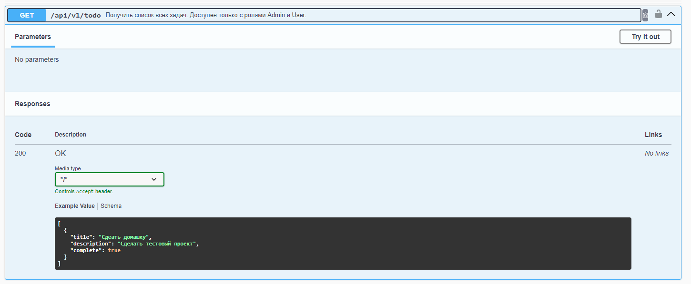
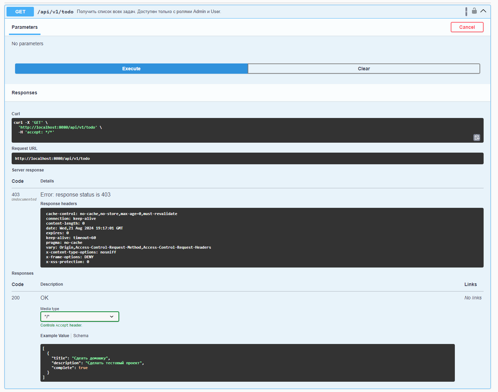
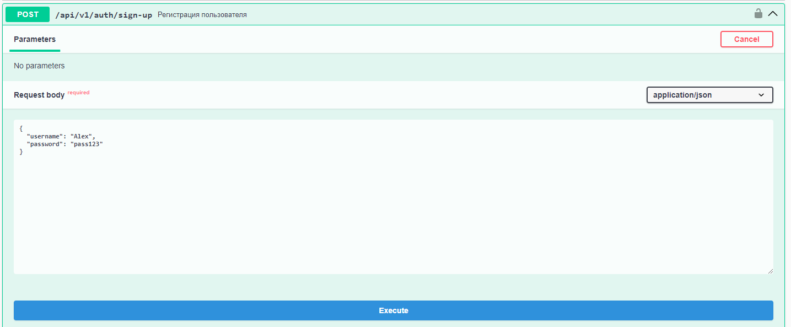
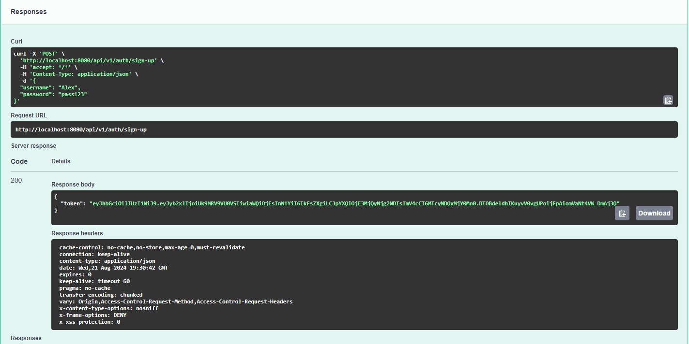

## Тестирование с использованием SWAGGER (OPEN API)

* После запуска переходим на http://localhost:8080/swagger-ui/index.html
По этой ссылки нам доступны все эндпоинты и их описание.

 
* Убедимся что без авторизации нет возможности обратится к защищённому эндпоинту. Стату 403.

Разворачиваем GET запрос из секции СПИСОК ЗАДАЧ и нажимаем кнопку Try ot out.

Далее нажимем Execute, получаем код ответа 403. Код ответа на статус ошибки "HTTP 403 Forbidden" указывает, что сервер понял запрос, но отказывается его авторизовать.

* Создадим пользователя и получим токен.
    - открываем POST - Регистрация пользователя запрос в секции Аутентификация
      
    - Нажимаем Try ot out Меняем имя пользователя в Request body если хотим или оставляем тестовые данные
    - Нажимаем Execute. Если всё прошло успешно, приложение вернёт статус 200 (ок) и токен, если произошли какие-либо ошибки (ошибка валидации или занятое имя пользователя) вернётся статус 403.
  
    - Токен получен. Копируем его.
* Добавим полученый токен, чтобы проверить функции доступные только для авторизированых учетных записей.
 - Нажимем Authorize

 - Вставляем в получившемся окошке наш токен и нажимаем Authorize

 - если все правильно увидим что мы залогинены (Authorized)

* Можно приступать к тестированию эндпоинтов требующих авторизацию.
- Создим две задачи и выведем список.

* Для получения роли админа нужно воспользоватся тестовым запросом GET /api/v1/auth/get-admin